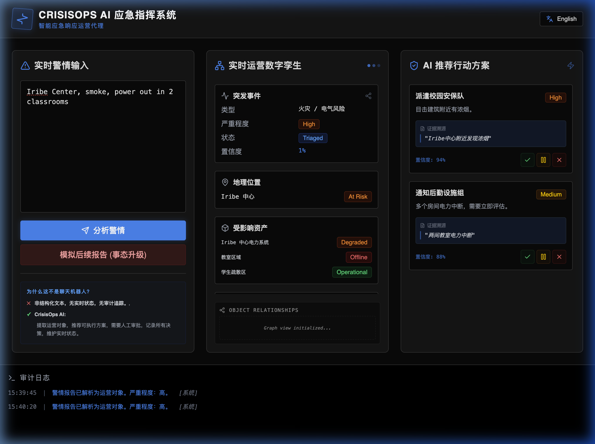

# CrisisOps AI: Operational State Machine Prototype

> **CrisisOps AI** transforms unstructured emergency reports into structured operational objects, AI-recommended actions, human approvals, and auditable logs.

## 🧠 The Thesis: AI as an Operational Layer

Most AI demos stop at text generation. **CrisisOps AI** focuses on the "last mile" of operations:
1. **Ontology over Text**: Don't just chat; model the world as a graph of objects (Incidents, Locations, Assets).
2. **Action-Oriented**: Intelligence is useless unless it leads to a discrete, executable decision.
3. **Human-in-the-Loop**: AI recommends; Humans approve. Accountability is non-negotiable in high-stakes environments.
4. **Dynamic State Management**: Real-world incidents evolve. The system must adapt its operational twin as new data flows in.

---

## 🚀 Key Features

### ⚡️ Intelligent Extraction & AI Simulation
Built-in simulation of AI analysis time (1.5s) with glassmorphism loading states, giving a premium feel of a heavy-duty backend processing engine.

### 🧩 Operational Twin (Digital Twin)
The system maintains a live object graph. Every object has a live status (e.g., Location: `Normal` → `Restricted`) that updates based on approved actions and new intelligence.

### 🔍 Evidence-Based Transparency
To eliminate the "Black Box" problem, every recommendation includes an **Evidence Panel** showing the exact snippet of text that triggered the AI's logic.

### 🛡️ Immutable Audit Log
All operator decisions (Approve, Hold, Reject) are recorded in an unalterable log with millisecond-precision timestamps, ensuring full operational accountability.

### 🌐 Multi-Language Support (i18n)
Native support for English and Chinese (中文) with a seamless toggle and localized keyword parsing logic.

---

## 🛠 Tech Stack

- **Framework**: React 18 + Vite
- **Animations**: Framer Motion (Staggered entrance, layout transitions, state pulses)
- **Language**: TypeScript (Strict Typing for Operational Safety)
- **Styling**: Tailwind CSS v4 (Using the new `@theme` engine)
- **Icons**: Lucide React
- **Aesthetic**: "Command Center" / "Cyber-Audit" Dark Mode

---

## 📦 Getting Started

### Local Development
1. Clone the repository
2. Install dependencies: `npm install`
3. Start the dev server: `npm run dev`

### Deployment
This project is optimized for **Vercel**.
1. Push code to GitHub.
2. Import repository to Vercel.
3. Build command: `npm run build`, Output: `dist`.

---

## 📖 Demo Scenario

1. **Step 1**: Input a report like *"Smoke reported near Iribe Center. Two classrooms lost power."*
2. **Step 2**: AI extracts objects. Click **Approve** on the "Dispatch" action.
3. **Step 3**: Notice the **Campus Safety** team status changes to `Assigned` in the middle panel.
4. **Step 4**: Click **Simulate Second Report**. The situation escalates. Severity jumps to **Critical**.
5. **Step 5**: Observe the **Location** status auto-transitioning to `Restricted`.

---

Developed as a Vertical Slice of Operational AI for high-stakes decision-making.
